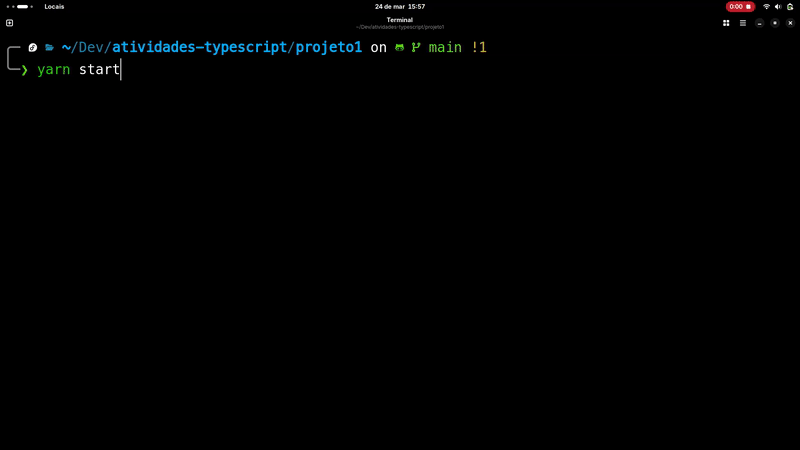

# CLI de Gerenciamento de Inventário em TypeScript

[](https://opensource.org/licenses/MIT)

Uma aplicação de linha de comando (CLI) para gerenciamento de inventário, desenvolvida em TypeScript, com persistência em memória. Projeto desenvolvido para a disciplina de Arquitetura de Software.

---

## 📋 Funcionalidades Principais

### **Gestão de Categorias**
- ✅ Criar novas categorias
- ✅ Listar todas as categorias
- 🔍 Buscar categorias por ID ou nome
- ✏️ Atualizar categorias existentes
- 🗑️ Remover categorias (com validação de produtos vinculados)

### **Gestão de Produtos**
- ✅ Criar novos produtos (vinculados a categorias)
- 📋 Listar todos os produtos
- 🔍 Buscar produtos por ID, nome ou categoria
- ✏️ Atualizar produtos existentes
- 🗑️ Remover produtos

---

## 🚀 Como Executar

### Pré-requisitos
- Node.js (v18+)
- npm

### Passos:
```bash
# 1. Clonar o repositório
git clone https://github.com/seu-usuario/inventario-cli-ts.git

# 2. Instalar dependências
npm install

# 3. Compilar o TypeScript
npx tsc

# 4. Executar o programa
node dist/index.js
```
## 🛠️ Tecnologias Utilizadas
- TypeScript (Tipagem estática e OOP)

## 📂 Estrutura do Projeto
```
src/
├── entities/       # Entidades de domínio
│   ├── Categoria.ts
│   └── Produto.ts
├── repositories/   # Repositórios em memória
│   ├── CategoriaRepository.ts
│   └── ProdutoRepository.ts
├── cli/            # Lógica da interface
│   └── mainMenu.ts
└── index.ts        # Ponto de entrada
```
## 🔧 Requisitos Técnicos Implementados
- [x] Tipos avançados (Union Types, Generics)
- [x] Interfaces para contratos de objetos
- [x] Classes com modificadores de acesso (public/private)
- [x] Configuração personalizada do tsconfig.json
- [x] Validação de integridade referencial
- [x] Tratamento de erros robusto

## 📌 Próximos Passos
- Migrar persistência para banco de dados SQLite
- Implementar relacionamentos via TypeORM
- Adicionar sistema de migrações
- Implementar queries complexas

---

### 📸 Captura de Tela do Sistema
 *Interface interativa do gerenciador de categorias*

---

Para dúvidas ou sugestões: **hugo.queiroz@a.ucb.br**

**Equipe:** Hugo Loiola de Queiroz, Julia, Isabella

**Orientador:** Prof. Weldes Lima Oliveira

> Projeto desenvolvido como parte do curso de Engenharia de Software da Universidade Católica de Brasília (UCB)
